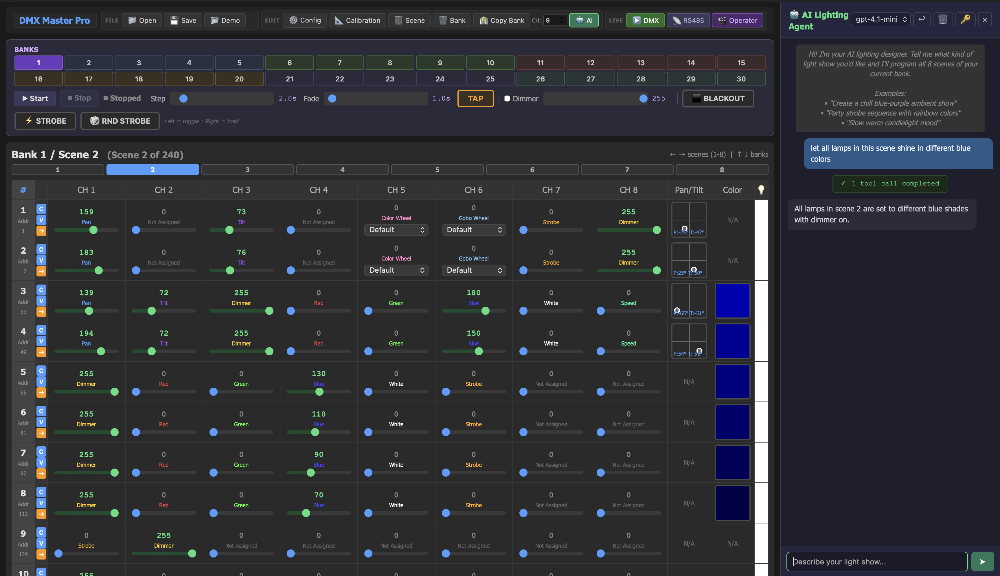

# Showlite DMX Master Pro USB — Scene Editor & Standalone Operator



**[Try it online](https://calkoe.github.io/Showlite-DMX-Master-Pro---Scene-Editor/)** — no installation required.

A browser-based scene editor for the **Showlite DMX Master Pro USB** lighting controller. Load, edit, and save `.PRO` files directly in your browser — no software installation required.

The `.PRO` file format was fully reverse-engineered from raw EEPROM dumps. This project documents the binary format and provides tools to view and modify scene data, channel configurations, fixture calibration, and gobo/color wheel presets outside the physical controller.

## Who Is This For?

- **Lighting technicians** who want to prepare or edit scenes on a computer instead of programming on the hardware
- **Hobbyists** using the Showlite DMX Master Pro USB who need more visibility into their programmed scenes

---

## How to Use the Scene Editor

### Opening a File

1. Open `index.html` in any modern browser (Chrome, Firefox, Edge, Safari)
2. Click the file input and select a `.PRO` file from your Showlite controller
3. The editor loads all 240 scenes (30 banks × 8 scenes)

### Navigating Scenes

- Use **← →** to cycle through scenes 1–8 within the current bank (wraps around)
- Use **↑ ↓** to switch between banks (wraps around), keeping the same scene position
- The header shows the current **Bank / Scene** number and whether the scene is empty

### Editing Channel Values

- Each scene displays a grid of **12 scanners × 16 channels**
- Drag sliders to change DMX values (0–255)
- Non-zero channels are highlighted in green
- A **dimmer indicator** column shows the brightness level of each scanner

### 2D Pan/Tilt Pad

For scanners with Pan and Tilt channels configured, a **2D control pad** appears in the scene table. Click and drag to position the fixture in a **-90° to +90°** range for both Pan (horizontal axis) and Tilt (vertical axis). The pad expands on hover for higher precision.

The pad uses the **3-point calibration** stored in Bank 30, Scenes 2–4 to translate degree positions into the correct DMX values for each scanner. This means:

- **-90°** maps to the DMX value recorded in Scene 2 (hard left / full down)
- **0°** maps to the DMX value recorded in Scene 3 (center / level)
- **+90°** maps to the DMX value recorded in Scene 4 (hard right / full up)

Between calibration points, DMX values are linearly interpolated. Each scanner uses its own calibration, so fixtures with different DMX ranges are handled correctly.

The pad displays degree tick marks at **-90°**, **0°**, and **+90°** on both axes, and a live readout showing the current Pan and Tilt position in degrees (e.g. `P:45° T:-30°`).

### Synchronized Scanner Control

1. Click scanner numbers on the left to **select/deselect** them (highlighted in blue)
2. Click **"All"** to select or deselect all scanners at once
3. When multiple scanners are selected, moving a slider or the Pan/Tilt pad on one scanner automatically mirrors the change to all other selected scanners
4. Useful for programming multiple identical fixtures at once

### Copying Scenes and Banks

- **Copy Scene**: Enter a source and destination scene number (1–240) and click Copy
- **Copy Bank**: Enter a source and destination bank number (1–30) to copy all 8 scenes at once

### Per-Scanner Copy / Paste / Fill Forward

Each scanner row has three small buttons (requires **double-click** to prevent accidental use):

- **C** — Copy all channel values of this scanner to the clipboard
- **V** — Paste the clipboard into this scanner (overwrites all channels)
- **→** — Fill forward: copies this scanner's channel values into all **following scenes** within the same bank (e.g. from Scene 3 to Scenes 4–8). Useful for setting a base position across an entire bank.

### Clearing Data

- **Clear Scene**: Resets all channel values in the current scene to 0
- **Clear Bank**: Resets all 8 scenes in the current bank to 0

### Saving Changes

Click **"💾 Download Modified .PRO"** to save the edited file. The browser downloads a new `.PRO` file (with `_modified` appended to the filename) that can be loaded back onto the controller.

---

## Channel Configuration (Bank 30, Scene 1)

Bank 30, Scene 1 is a **special configuration scene** that defines what each channel controls for each scanner. This data is used by the editor to display contextual labels, enable the 2D Pan/Tilt pad, and power the gobo/color preset system.

### How to Set It Up

1. Click **"⚙️ Enter Channel Config"** in the toolbar
2. For each scanner, use the dropdown on every channel to assign its function:

| ID  | Attribute     | Description                      |
| --- | ------------- | -------------------------------- |
| 0   | NONE          | Not assigned / generic channel   |
| 1   | PAN           | Pan (horizontal movement)        |
| 2   | PAN_FINE      | Pan fine (16-bit precision)      |
| 3   | TILT          | Tilt (vertical movement)         |
| 4   | TILT_FINE     | Tilt fine (16-bit precision)     |
| 5   | DIMMER        | Master brightness                |
| 6   | RED           | Red color component              |
| 7   | GREEN         | Green color component            |
| 8   | BLUE          | Blue color component             |
| 9   | WHITE         | White/amber component            |
| 10  | COLOR_WHEEL   | Color wheel position             |
| 11  | GOBO_WHEEL    | Gobo pattern wheel position      |
| 12  | STROBE        | Strobe speed/effect              |
| 13  | SPEED         | Movement speed                   |
| 14  | WLED_FX_ID    | WLED effect selection (dropdown) |
| 15  | WLED_FX_SPEED | WLED effect speed                |
| 16  | WLED_FX_INT   | WLED effect intensity            |
| 17  | WLED_FX_PALT  | WLED palette selection           |
| 18  | WLED_FX_OPT   | WLED effect option               |

3. The mappings apply immediately to all other scenes in the editor

> **Note:** This configuration is stored inside the `.PRO` file itself (Bank 30, Scene 1). It does not affect the physical controller's behavior — it only controls how the web editor displays channels.

---

## Fixture Calibration & Gobo/Color Presets (Bank 30, Scenes 2–8)

Bank 30, Scenes 2–8 store **calibration reference values** and **gobo/color wheel presets**.

### Pan/Tilt Calibration (Scenes 2–4)

These scenes let you record the DMX values for specific physical angles:

| Scene | Angle | Purpose               |
| ----- | ----- | --------------------- |
| 2     | -90°  | Hard left / full down |
| 3     | 0°    | Center / level        |
| 4     | +90°  | Hard right / full up  |

Adjust the Pan and Tilt sliders until the connected fixture reaches the exact physical position, then save. The editor highlights Pan/Tilt channels with a yellow background and "📍 Calib" label.

Once all three calibration points are set for a scanner, the **2D Pan/Tilt pad** in normal scenes (Banks 1–29) will convert degree positions to DMX values using piecewise linear interpolation between the three reference points. This allows you to position fixtures in degrees regardless of their underlying DMX range.

### Gobo/Color Wheel Presets (Scenes 2–8)

All 7 scenes double as **preset storage** for gobo and color wheel channels:

- **Scenes 2–4**: Pan/Tilt calibration AND presets 1–3
- **Scenes 5–8**: Dedicated presets 4–7

#### Setting Up Presets

1. Click **"📐 Enter Calibration Scenes"** to navigate to Bank 30, Scene 2
2. Use arrow keys to move between scenes 2–8
3. Adjust the Gobo Wheel and Color Wheel channel sliders to the desired DMX values
4. Each scene stores one preset per scanner — presets can differ between scanners (useful for mixed fixtures)

#### Using Presets in Normal Scenes

In Banks 1–29, Gobo and Color Wheel channels display a **dropdown menu** instead of a slider:

- **Default**: Sets the channel to 0 (off/default position)
- **Preset 1–7**: Instantly load the DMX value stored in Bank 30, Scenes 2–8

The dropdown automatically detects which preset matches the current value. Changing a calibration value in Bank 30 updates all scenes that reference that preset.

---

## Live DMX Output

The editor can send DMX data directly to connected fixtures via a USB-to-DMX interface using the **Web Serial API** (Chrome/Edge only).

### Supported Interfaces

- **Raw USB-to-RS485** (default): Cheap adapters that pass serial bytes directly to the DMX bus. Uses 250000 baud, 8N2, with BREAK signal timing.
- **ENTTEC DMX USB Pro**: Professional interface using framed packets at 57600 baud.

Click the **📡 Raw RS485 / ENTTEC Pro** button to toggle between modes.

### Usage

1. Click **"▶️ DMX Output"** to open the browser serial port picker
2. Select your USB-DMX adapter
3. The editor continuously sends the current scene's channel data at 20 Hz
4. Slider changes are reflected in real-time on connected fixtures
5. Click **"🔴 DMX Stop"** to disconnect

> **Note:** Web Serial requires Chrome or Edge. The serial port prompt requires a user gesture (the button click).

---

## Operator Mode

The **Operator** provides a full live-performance control surface: auto-step through scenes with crossfade, quick bank switching, tap tempo, master dimmer, and strobe effects — all without modifying the underlying scene data.

Click **"🎬 Operator"** in the toolbar to toggle the operator panel.

### Bank Quick Select

A 30-button bank grid (color-coded in groups of 5) lets you jump to any bank instantly:

- **Left click** → permanent bank switch
- **Right click (hold)** → temporary preview; releases back to the previous bank

### Transport & Timing

- **Start / Stop** — begin or halt the auto-step loop through scenes 1–8 of the current bank
- **Step Time** (0.1–20s) — interval between scene transitions
- **Fade Time** (0.1–20s) — DMX crossfade duration between scenes
- **TAP** button — tap in the beat; averages up to 8 taps to set Step and Fade time together (fade = 50% of step). Resets after 3 seconds of inactivity.

### Master Dimmer

A 0–255 slider that scales all scanner dimmer channels proportionally. Enable it with the checkbox; when unchecked the dimmer override is bypassed.

### Effect Buttons

All effect buttons support two interaction modes:

- **Left click** → toggle on/off (permanent)
- **Right click (hold)** → active only while held (temporary)

| Button            | Effect                                                                                     |
| ----------------- | ------------------------------------------------------------------------------------------ |
| **⬛ BLACKOUT**   | Forces all dimmer channels to 0 (highest priority)                                         |
| **⚡ STROBE**     | All scanners flash together at 10 Hz (30% duty cycle)                                      |
| **🎲 RND STROBE** | Random ~50% of scanners flash; the others stay off. Random selection changes every 200 ms. |

### Crossfade Behavior

- All DMX channel values are **linearly interpolated** between the previous and next scene over the fade duration
- **Gobo Wheel**, **Color Wheel**, and **WLED FX ID** channels are excluded from fading — they snap instantly to avoid garbage intermediate values
- The operator cycles through scenes 1–8 within the current bank, wrapping back to scene 1
- The scene display updates as scenes advance

### DMX Output Integration

When the operator panel is open and DMX output is active, all operator overrides (master dimmer, blackout, strobe) are applied to the DMX stream in real-time. This means connected fixtures respond immediately to operator controls without modifying the saved scene data.

---

## Importing and Exporting on the Showlite Controller

### Exporting a .PRO File (Controller → USB)

1. Insert a USB flash drive into the **USB port** on the back of the Showlite DMX Master Pro USB
2. On the controller, enter the **USB save mode** (consult your controller's manual for the exact button sequence — typically hold a combination of function buttons)
3. The controller writes its entire EEPROM contents to the USB drive as a `.PRO` file (e.g., `FILE1.PRO`)
4. The display will show "succeeded" when the write is complete
5. Remove the USB drive and copy the `.PRO` file to your computer

### Importing a .PRO File (USB → Controller)

1. Place the modified `.PRO` file on a USB flash drive (use the original filename, e.g., `FILE1.PRO`)
2. Insert the USB drive into the controller
3. Enter the **USB load mode** on the controller
4. The controller reads the `.PRO` file and writes it to its internal EEPROM
5. Once complete, all scenes, chases, and settings from the file are active on the controller

> **Important:** The file must be exactly **131,584 bytes**. The editor preserves this size automatically. Use a FAT32-formatted USB drive for best compatibility.

---

## AI Lighting Agent

The editor includes a built-in **AI lighting designer** powered by the OpenAI API. It can create complete light shows by programming all 8 scenes of a bank through natural language commands.

### Setup

1. Click the **"🤖 AI Agent"** button in the toolbar to open the chat panel
2. Enter your OpenAI API key when prompted (stored in browser localStorage)
3. Describe the light show you want

### Model Selection

Use the dropdown in the chat header to choose your preferred OpenAI model:

- `gpt-4o` (default), `gpt-4o-mini`, `gpt-4.1`, `gpt-4.1-mini`, `gpt-4.1-nano`, `o4-mini`

The selection is persisted across sessions.

### What It Can Do

- **Create full shows**: "Create a chill blue-purple ambient show" → programs all 8 scenes with color progressions, dimmer dynamics, and smooth loops
- **Set colors**: "Make all scanners red" → sets RGB values across all scenes
- **Position fixtures**: "Create a circular motion on scanner 1" → plans an 8-step pan/tilt trajectory
- **Use calibration**: Reads color wheel and gobo wheel presets from Bank 30 before setting wheel channels
- **Copy and arrange**: "Copy scene 1 to scenes 2-8" or "Copy this bank to bank 5"

### Available AI Tools

| Tool                 | Description                                                  |
| -------------------- | ------------------------------------------------------------ |
| `get_channel_config` | Read channel attribute mappings for all scanners             |
| `get_wheel_presets`  | Read calibrated color/gobo wheel DMX values from Bank 30     |
| `get_scene_info`     | Read all channel values for a scene                          |
| `set_scene_batch`    | Set multiple scanners/channels in one scene (most efficient) |
| `set_colors_batch`   | Set RGB(W) + dimmer for multiple scanners                    |
| `set_position`       | Set pan/tilt in degrees using calibration                    |
| `set_channel`        | Set a single channel value                                   |
| `clear_scene`        | Zero all channels in a scene                                 |
| `jump_to_scene`      | Navigate the editor to a scene                               |
| `copy_scene`         | Copy a scene within the current bank                         |
| `copy_bank_to`       | Copy the current bank to another bank                        |

### Design Intelligence

The AI is instructed to:

- Apply changes to **all 8 scenes** by default (the whole bank) unless a specific scene is requested
- Ensure **smooth loops** — Scene 8 transitions cleanly back to Scene 1
- Plan **motion patterns** across all 8 frames before setting values
- Use **calibrated preset values** for color/gobo wheels instead of guessing
- Keep the **dimmer above 0** so lights are actually visible

### Rate Limiting

The agent auto-retries on OpenAI rate limit errors (HTTP 429) up to 3 times with parsed wait times. A tool call counter in the chat shows progress during large operations.

---

## Technical Details

### File Structure Overview

The `.PRO` file is a **raw EEPROM image** — a 1:1 copy of the controller's non-volatile memory.

| Property     | Value                                    |
| ------------ | ---------------------------------------- |
| File size    | 131,584 bytes (128 KB + 512 B)           |
| Block size   | 256 bytes                                |
| Total blocks | 514                                      |
| Byte order   | Big-endian                               |
| Empty byte   | `0x00` (scenes) / `0xFF` (erased EEPROM) |

### Memory Layout

```
Offset      Blocks     Size       Description
─────────────────────────────────────────────────────
0x00000     0          256 B      File header ("succeeded" + padding)
0x00100     1          256 B      Padding (all zeros)
0x00200     2          256 B      Filler (all 0xFF)
0x00300     3–244      61,824 B   Scene data area (240 scenes + observed padding)
0x0F300     243–253    2,816 B    Chase / program definitions
0x0FE00     254        256 B      Controller configuration
0x0FF00     255        256 B      Validity marker (0x55AA × 10)
0x10000     256–513    65,792 B   Second EEPROM bank (mostly 0xFF)
0x20000     —          512 B      Trailer (all 0xFF)
```

### Scene Data (Blocks 3–247)

The controller stores **30 banks × 8 scenes = 240 scenes**. Each scene occupies one 256-byte block.

- **+256 bytes before Bank 7**
- **+128 bytes before Bank 12**

**Addressing formula:**

```
bank_offset = 0x300
            + (bank - 1) × 0x800
            + (bank >= 7  ? 0x100 : 0)
            + (bank >= 12 ? 0x080 : 0)

scene_offset = bank_offset + (scene - 1) × 0x100
```

This is the addressing model currently used by the decoder because it matches the observed byte positions in `FILE6.PRO`, including Bank 12 Scene 1 channel data.

**Scene record layout (256 bytes):**

```
Offset    Size    Content
───────────────────────────────
0x00      1 B     Count byte (number of non-zero channel bytes in scanner data)
0x01      192 B   12 scanners × 16 channels (DMX values 0–255)
0xC1      63 B    Scene metadata (per-scanner channel bitmasks, fade time, speed)
```

The first byte of each scene record is a count byte that holds the number of non-zero DMX channel values in the scanner data area (bytes 1–192). This is used by the controller firmware for fast empty-scene detection and integrity checking.

Each scanner row stores 16 bytes, one byte per DMX channel. The physical controller exposes channels 1–8 on Page A and 9–16 on Page B, but the file stores all 16 sequentially.

**Scene metadata area (bytes 0xC1–0xFF, 63 bytes):**

The metadata area contains per-scanner channel enable bitmasks at odd-indexed positions:

```
Byte 0xC1 (193): Scanner 1 Page A bitmask (bit 0 = CH1, bit 7 = CH8)
Byte 0xC3 (195): Scanner 2 Page A bitmask
...
Byte 0xD7 (215): Scanner 12 Page A bitmask
```

A set bit indicates the corresponding channel was programmed (has a recorded value) in this scene.

### Default DMX Address Mapping

| Scanner | DMX Start | DMX End |
| ------- | --------- | ------- |
| 1       | 1         | 16      |
| 2       | 17        | 32      |
| 3       | 33        | 48      |
| 4       | 49        | 64      |
| 5       | 65        | 80      |
| 6       | 81        | 96      |
| 7       | 97        | 112     |
| 8       | 113       | 128     |
| 9       | 129       | 144     |
| 10      | 145       | 160     |
| 11      | 161       | 176     |
| 12      | 177       | 192     |

### Empty Scene Detection

A scene is empty/unprogrammed if all 256 bytes (scanner data + metadata) are `0x00`.

### Validity Marker (Block 255)

The first 20 bytes of block 255 contain a repeating `0x55 0xAA` pattern. The controller firmware checks this signature to verify the EEPROM has been properly written. If absent or corrupted, the controller treats the memory as blank.

### Further Format Details

---

## License

This project is based on independent reverse engineering of the Showlite DMX Master Pro USB EEPROM format. It is not affiliated with or endorsed by the manufacturer.
